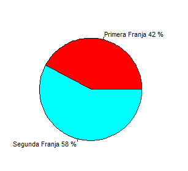
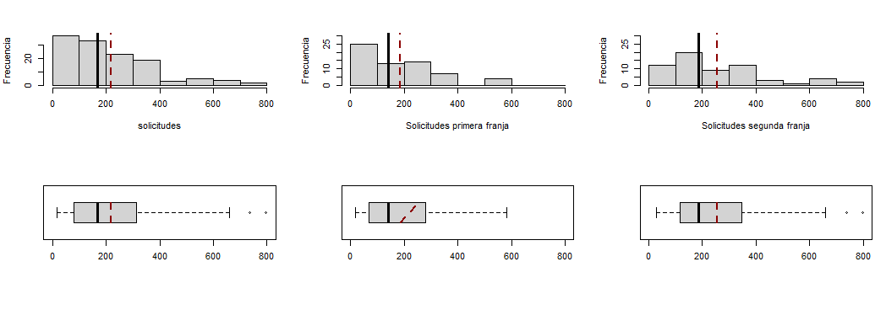

# Análisis de las solicitudes de uniones de hecho por la población de castilla y león
## Índice
1. [Introducción](#introducción)
-   1.1 [Contexto](contexto)
-   1.2 [Objetivo](objetivo)
-   1.3 [alcance](alcance)
2. [Metodología](metodologia)
-   2.1 [Origen de los datos](origen)
-   2.2 [Herramientas](herramientas)
-   2.3 [Diseño](diseño)
3. [Resultados](resultados)
-   3.1 [Medidas estadístcas](medidas)
-   3.2 [Tablas de contingencia](tablas)
-   3.3 [Diagramas](diagramas)
4. [Análisis de resultados](analisis)
5. [Conclusión](conclusion)
## <u> Introducción </u>

### <strong>Contexto</strong>
En la comunidad de Castilla y León se solicitan anualmente miles de solicitudes de uniones de hecho, debido a la gran cantidad de solicitudes en el ultimo año, se han dividido el numero de solicitudes en dos grandes grupos, el primero se engloba con todas las solicitudes desde el año 2010 hasta el año 2016 y el segundo grupo contiene todas las solicitudes que comprenden desde el año 2017 hasta el año 2023

### <strong>Objetivo</strong>
El objetivo de la investigación es: "Realizar un análisis estadístico descriptivo de las solicitudes de hecho en la comunidad de Castilla y León comparando las diferencias que existen respecto a número de solicitudes de los ultimos años con las solicitudes de años pasados".

### <strong>Alcance</strong>
La investigacion se limita al número de solicitudes de uniones de hecho localizadas en Castilla y León en los años que comprenden entre 2010 y 2023.

## <u>Metodología</u>
### <strong>Origen de los datos</strong>
Se ha trabajado con un archivo "uniones_de_hecho.csv" que incluye todas las solicitudes presentadas en Castilla y León en los ultimos años. El archivo ha sido presentado por el ayuntamiento de la comunidad de Castilla y León.

### <strong>Herramientas</strong>
Se han procesado los datos utilizando la aplicación RStudio para linux, versión 2024.09.0+375 y el paquete "e1071" para calcular los coeficientes de asimetría y apuntamiento.

### <strong>Diseño</strong>
El resumen del diseño es el siguiente:

- Variables estadísticas: Se ha analizado la variable estadística “Solicitudes presentadas”, de tipo cuantitativo discreto, con valores positivos que pueden variar desde 18 hasta 797. También se ha utilizado la variable estadística “Franja”, de tipo cualitativo, con los valores “Primera” y “Segunda”, correspondientes a dos períodos temporales distintos.

- Población: Solicitudes de uniones de hecho registradas entre 2010 y 2023.

- Muestra: 126 observaciones válidas, de las cuales 63 corresponden a la primera franja (años 2010 a 2016) y 63 a la segunda franja (años 2017 a 2023).

- Organización de datos: Se ha trabajado con los datos del archivo “uniones_de_hecho.csv”, eliminando observaciones erróneas y completando un total de 126 registros válidos. Se ha añadido una nueva columna, “Franja”, que asigna el valor “Primera” para los registros de los años 2010 a 2016 y el valor “Segunda” para los registros de los años 2017 a 2023. Esto ha permitido analizar las diferencias en el comportamiento de las solicitudes de uniones de hecho entre ambas franjas temporales.
## <u>Resultados</u>

### <strong>Medidas estadísticas</strong>
En esta tabla se muestran los resultados de las medidas estadístcas de centralización, dispersion, localización y forma más relevantes, para el total de solicitudes y para las solicitudes de 2010-2016 y 2017-2023.

| Medida | Todos | Primera franja | Segunda franja |
| ------- |-------|----------------|----------------|
| Tamaño de muestra | 126 | 63 | 63|
| Medidas de centralización |
| Media | 219.65 | 185.17  | 254.13  |
| Mediana |  169 | 141 | 186 | 
| Medidas de dispersión | 
| Mínimo | 18 | 18 | 30 |
| Máximo | 797 | 581 | 797 |
| Rango | 779 | 563 | 767 |
| Varianza | 28866.85 | 20646.57 | 35137.18 |
| Desviación estándar | 169.9 | 143.69 | 187.45 |
| Coeficiente de variación | 0.77 | 0.78 | 0.74 |
| Medidas de localización |
| Primer Cuartil (Q1) | 82.75 | 69.5 | 117.0 |
| Tercer Cuartil (Q3) | 311.00 | 278.5 | 346.5 |
| Rango intercuartílico (IQR) | 228.25 | 209.0 | 229.5 |
| Medidas de forma | 
| Coeficiente de asimetría | 1.19 | 1.07 | 1.06 | 
| Coeficiente de apuntamiento (curtosis)| 0.96 | 0.56 | 0.38 |
| Otras | 
| Valores inferiores a la media | 75 (60%) | 37 (59%) | 38 (60%) |
| Valores superiores a la media | 51 (40%) | 26 (41%) | 25 (40%) |

### <strong>Tablas de contingencia</strong>
En esta tabla se muestra la tabla de contingencia para las variables solicitudes y franja en el caso de agrupar las solicitudes en 8 intervalos. En la tabla se representa con f las frecuencias absolutas y con h las frecuencias relativas.

| solicitud/franja | Primera franja | Segunda franja | f solicitud | h solicitud |
|------------------|----------------|----------------|-------------|-------------|
| [0,100) | 25 | 12 | 37 | 0.29 |
| [100,200) | 13 | 20 | 33 | 0.26 |
| [200,300) | 13 | 9 | 22 | 0.17 |
| [300,400) | 7 | 12 | 19 | 0.15 |
| [400,500) | 1 | 3 | 4 | 0.03 |
| [500,600) | 4 | 1 | 5 | 0.04 |
| [600,700) | 0 | 4 | 4 | 0.03 |
| [700,800] | 0 | 2 | 2 | 0.02 |
| f franja | 63 | 63 | 126 | |
| h franja | 0.50 | 0.50 | | 1| 

### <strong>Diagramas</strong>
En el siguiente diagrama se muestra el porcentaje de solicitudes en cada una de las franjas respecto al total de solicitudes 

En los siguientes diagramas se muestran los histogramas y diagramas de caja (boxplot) de la variable solicitudes, en el caso de los histogramas, agrupada en ocho intervalos, considerando todas las franjas(izquierda), sólo las solicitudes que pertenecen a la primera franja (centro) y sólo las solicitudes que pertenecen a la segunda franja (derecha).
En los diagramas aparecen tanto la mediana (línea negra continua) como la media (línea roja
discontinua).

## <u>Análisis de resultados</u>
En este apartado se realiza la interpretación de los resultados obtenidos respecto a las solicitudes de uniones de hecho, divididas en dos franjas temporales: la primera franja (2010-2016) y la segunda franja (2017-2023). Se ha considerado una muestra total de 126 observaciones, con 63 registros para cada franja temporal.

1. Análisis descriptivo de las medidas de centralización:
Como se observa en la tabla de medidas de centralización, la media de solicitudes presentadas en la primera franja es de 185.17, mientras que en la segunda franja asciende a 254.13. De igual manera, la mediana también es superior en la segunda franja (186) en comparación con la primera (141). Esto indica que, en promedio, se han presentado más solicitudes de uniones de hecho en la segunda franja, lo cual sugiere un incremento en la demanda en los últimos años. La media general para toda la muestra es de 219.65 solicitudes, con una mediana de 169, lo que refleja una distribución sesgada hacia valores menores.

2. Dispersión de los datos:
La dispersión de los datos, evaluada a través del rango, la varianza y la desviación estándar, muestra diferencias importantes entre ambas franjas. El rango en la primera franja es de 563, mientras que en la segunda franja es de 767, lo que indica una mayor variabilidad en la cantidad de solicitudes presentadas durante los últimos años. La desviación estándar de la primera franja es de 143.69, mientras que en la segunda franja es mayor, alcanzando 187.45, lo que sugiere que en la segunda franja hay una mayor dispersión de las solicitudes alrededor de su media. Esto se confirma también con los coeficientes de variación (0.78 en la primera franja y 0.74 en la segunda), los cuales, aunque similares, muestran una ligera mayor dispersión relativa en la primera franja.

3. Análisis de la forma de la distribución:
El análisis de los coeficientes de asimetría muestra un sesgo positivo en ambas franjas (1.07 en la primera y 1.06 en la segunda), lo que indica que hay más solicitudes por debajo de la media. Este sesgo hacia la derecha se aprecia también en los histogramas (ver figura correspondiente), donde se observa una mayor concentración de frecuencias en los valores más bajos de solicitudes. Asimismo, el coeficiente de curtosis es positivo para ambas franjas (0.56 en la primera y 0.38 en la segunda), lo que sugiere una distribución más "leptocúrtica" o concentrada en torno a la media, aunque esta característica es más marcada en la primera franja.

4. Análisis de los cuartiles y el rango intercuartílico (IQR):
El análisis de los cuartiles revela que el 50% de las solicitudes en la primera franja se encuentran entre 69.5 y 278.5, mientras que en la segunda franja este intervalo va de 117 a 346.5. Esto muestra que, en términos generales, los valores de las solicitudes en la segunda franja tienden a ser más altos que en la primera, y a su vez, presentan una mayor dispersión (rango intercuartílico de 229.5 en la segunda franja frente a 209 en la primera).

5. Análisis de la frecuencia y distribución de las solicitudes:
De la tabla de frecuencias y el diagrama de barras agrupadas, se observa que la mayoría de las solicitudes en ambas franjas se concentran en el rango de [0,100) y [100,200). Sin embargo, en la segunda franja hay un porcentaje ligeramente superior de solicitudes en los rangos más altos, como el intervalo de [300,400), lo cual se alinea con el incremento de la media y la mediana en esta franja. En el diagrama de pastel de la figura correspondiente, se visualiza que cada franja temporal representa el 50% de la muestra total, lo que permite una comparación equitativa entre ambas franjas.

6. Diagramas de caja y datos atípicos:
En los diagramas de caja (ver figura correspondiente), se puede apreciar que la segunda franja presenta un mayor número de valores extremos, lo que contribuye a la mayor dispersión observada. En la primera franja, los valores atípicos se concentran en el rango superior, mientras que en la segunda franja se presentan algunos casos con valores de hasta 797 solicitudes, un número significativamente más alto que cualquier otro en la muestra. Este comportamiento es indicativo de un posible aumento en la variabilidad de las solicitudes presentadas en los últimos años.

## <u>Conclusión</u>
Los resultados del análisis muestran un claro incremento en el número de solicitudes de uniones de hecho a lo largo del tiempo, con un aumento notable de la media y la dispersión en la segunda franja temporal. Esto sugiere un cambio en la dinámica de las solicitudes a partir de 2017, posiblemente vinculado a factores sociales, legales o culturales que han llevado a una mayor demanda de este tipo de uniones. Las medidas de dispersión y los diagramas de caja indican una mayor variabilidad en la segunda franja, lo cual podría reflejar fluctuaciones en la aceptación o el interés por las uniones de hecho en distintos momentos de esta última etapa.
